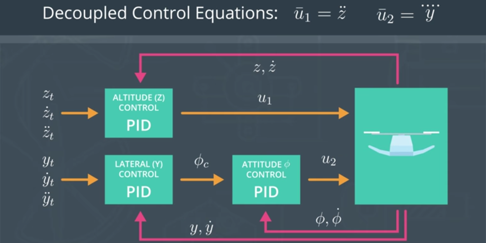
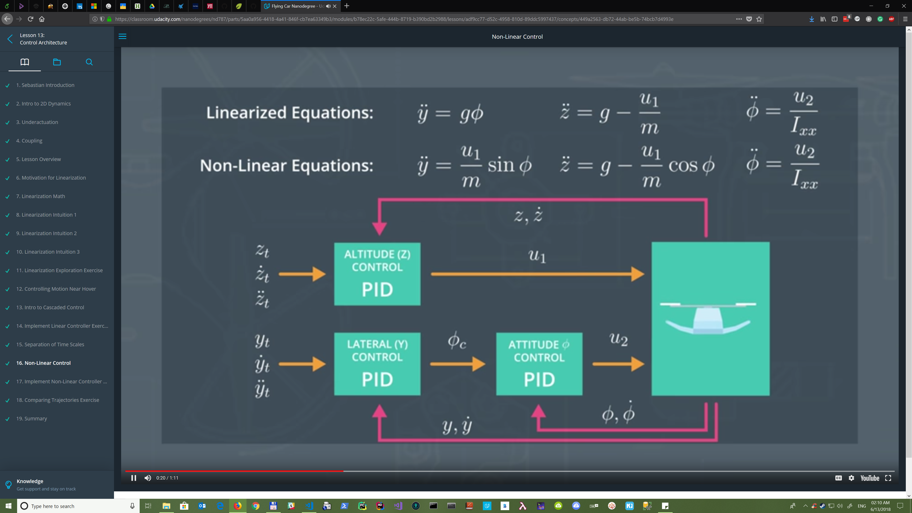
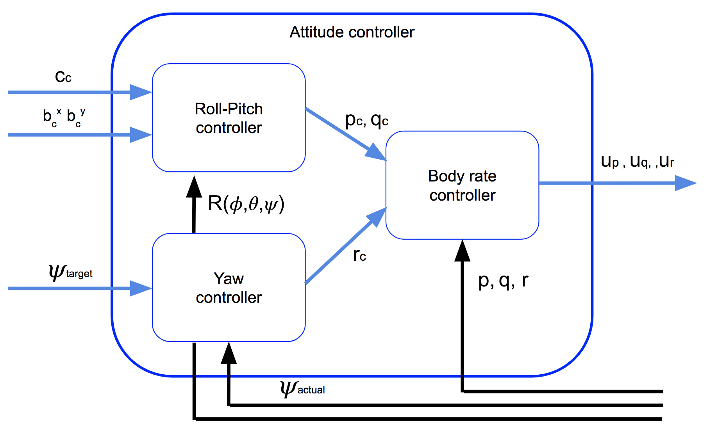
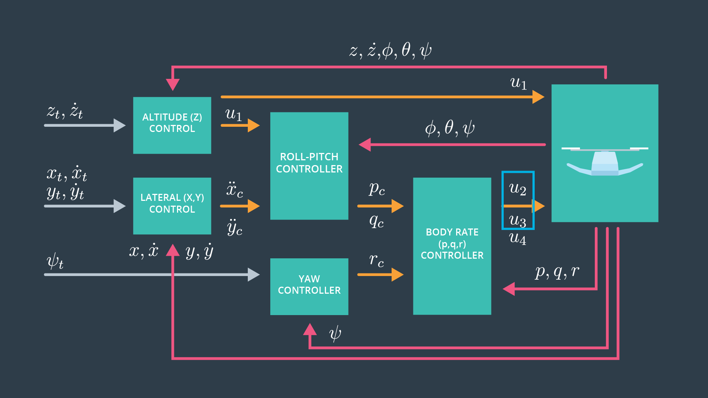

**NOTES: To use with VSCode - install "Markdown+Math" extension**

<!-- TOC -->

- [Term 1: Aerial Robotics](#term-1-aerial-robotics)
    - [Lesson 11 - Vehicle Dynamics](#lesson-11---vehicle-dynamics)
        - [11.7 - Rotor Physics](#117---rotor-physics)
        - [11.9 - F Equals MA](#119---f-equals-ma)
        - [11.10 - Unbalanced Moments cause Rotational Acceleration](#1110---unbalanced-moments-cause-rotational-acceleration)
            - [Two rotors](#two-rotors)
        - [11.19 - Decomposing Thrust Vectors](#1119---decomposing-thrust-vectors)
        - [11.20 - Calculating Moments](#1120---calculating-moments)
        - [11.24 - Controlling a 2D Drone Exercise](#1124---controlling-a-2d-drone-exercise)
    - [Lesson 12 - Introduction to Vehicle Control](#lesson-12---introduction-to-vehicle-control)
        - [12.5 - Perfect is impossible](#125---perfect-is-impossible)
        - [12.6 - Simple Control Diagrams](#126---simple-control-diagrams)
        - [12.7 - P Controllers](#127---p-controllers)
        - [12.8 - Implement P Controller Exercise](#128---implement-p-controller-exercise)
        - [12.12 - PD Control](#1212---pd-control)
        - [12.13 - Implement PD Controller Exercise](#1213---implement-pd-controller-exercise)
        - [12.14 - PD Incorporating Feedforward Control](#1214---pd-incorporating-feedforward-control)
        - [12.16 - PD Math and Reparametrization](#1216---pd-math-and-reparametrization)
        - [12.17 - Overshoot, Rise Time, Settling Time](#1217---overshoot-rise-time-settling-time)
        - [12.19 - PID Control](#1219---pid-control)
        - [12.20 - PID Control Exercise](#1220---pid-control-exercise)
        - [12.21 - Summary](#1221---summary)
    - [Lesson 13 - Control Architecture](#lesson-13---control-architecture)
        - [13.2 - Intro to 2D Dynamics](#132---intro-to-2d-dynamics)
        - [13.4 - Coupling](#134---coupling)
        - [13.6 Motivation for Linearization](#136-motivation-for-linearization)
        - [13.7 Linearization Math](#137-linearization-math)
        - [13.11 Linearization Exploration Exercise](#1311-linearization-exploration-exercise)
        - [13.12 Controlling Motion Near Hover](#1312-controlling-motion-near-hover)
        - [13.13 Intro to Cascaded Control](#1313-intro-to-cascaded-control)
        - [13.14 Implement Linear Controller Exercise](#1314-implement-linear-controller-exercise)
        - [13.16 Non-Linear Control](#1316-non-linear-control)
        - [13.17 Implement Non-Linear Controller Exercise](#1317-implement-non-linear-controller-exercise)
    - [Lesson 14 - Full 3D Control](#lesson-14---full-3d-control)
        - [14.5 Tracking 3D Dynamics Overview](#145-tracking-3d-dynamics-overview)
        - [14.7 3D Drone Part 1 Exercise](#147-3d-drone-part-1-exercise)
            - [Calculate Linear accelerations](#calculate-linear-accelerations)
            - [Getting the rate of change of the Euler angles](#getting-the-rate-of-change-of-the-euler-angles)
            - [Advance state function](#advance-state-function)
            - [Attitude controller](#attitude-controller)
            - [Lateral controller](#lateral-controller)
            - [Roll-Pitch controller](#roll-pitch-controller)
            - [Body rate controller](#body-rate-controller)
            - [Yaw controller](#yaw-controller)
            - [Altitude Controller](#altitude-controller)
            - [Flight planning](#flight-planning)
        - [14.9 Euler's Equations in a Rotating Frame](#149-eulers-equations-in-a-rotating-frame)
        - [14.19 Controller Design](#1419-controller-design)

<!-- /TOC -->

**NOTES: To use with VSCode - install "Markdown+Math" extension**

# Term 1: Aerial Robotics

**Warning:** Numbers of sections can be changed in future

## Lesson 11 - Vehicle Dynamics

### 11.7 - Rotor Physics

>$$F = k_f \cdot \omega^2$$

>$k_f$ - constant of proportionality for force/thrust coefficient\
>$\omega$ - rotation rate of a rotor ($rad/sec$)

>$$M = k_m \cdot \omega^2$$

>$k_m$ - constant of proportionality for moment/angular torque coefficient\
>$\omega$ - rotation rate of a rotor ($rad/sec$) - or rotational velocity

### 11.9 - F Equals MA

>$$F_z = m_z \cdot \ddot{z}$$
>$$F = m \cdot g$$
>$$F_{net} = m \cdot a$$ 

>$F_{net}$ - net force
>$m$ - mass of vehicle\
>$g$ - gravitational constant - 9.81 ($m/sec^2$)\

>$$F_{thrust} = F - F_{net}$$
>$$F_{thrust} = m \cdot g - m \cdot a$$
>$$F_{thrust} = m \cdot (g - a)$$

>$F_{net}$ - net force\
>$m$ - mass of vehicle\
>$F_{thrust}$ - thrust force\
>$g$ - gravitational constant - 9.81 ($m/sec^2$)

>$$F_{net} = F_{thrust} - F$$
>$$F_{net} = F_{thrust} - m \cdot g$$

>$F_{net}$ - net force\
>$F_{thrust}$ - thrust force\
>$m$ - mass of vehicle\
>$g$ - gravitational constant - 9.81 ($m/sec^2$)

### 11.10 - Unbalanced Moments cause Rotational Acceleration 

#### Two rotors

Strange equation related to $F_{net}$ - it should be $F_{net} = F_{thrust} - F$ but we have $F_{net} = F - F_{thrust}$.\
Maybe because Z is positive down.

>$$\ddot{z} = \frac{F_{net}}{m}$$
>$$\ddot{z} = \frac{m \cdot g - F_{thrust}}{m}$$
>$$\ddot{z} = \frac{m \cdot g - k_f \cdot (\omega_1 ^ 2 + \omega_2 ^ 2)}{m}$$
>$$\ddot{z} = g - \frac{k_f}{m} \cdot (\omega_1 ^ 2 + \omega_2 ^ 2)$$

>$F_{net}$ - net force\
>$F_{thrust}$ - thrust force\
>$m$ - mass of vehicle\
>$\ddot{z}$ - vertical/linear acceleration ($m/sec^2$)\
>$g$ - gravitational constant - 9.81 ($m/sec^2$)\
>$k_f$ - constant of proportionality for force/thrust coefficient\
>$\omega_1, \omega_2$ - angular velocities

>$$M_z = I_z \cdot \ddot{\psi}$$
>$$\ddot{\psi} = \frac{M_z}{I_z}$$
>$$\ddot{\psi} = \frac{k_m}{I_z} \cdot (\omega_2 ^ 2 - \omega_1 ^ 2)$$

>$k_m$ - constant of proportionality for moment/angular torque coefficient\
>$\ddot{\psi}$ - angular/rotational acceleration ($rad/sec^2$)\
>$M_z$ - \
>$I_z$ - moment of inertia around the z-axis\
>$\omega_1, \omega_2$ - angular velocities

### 11.19 - Decomposing Thrust Vectors

>$$F_y = F_{thrust} \cdot \sin \phi$$
>$$\ddot{y} = \frac{F_y}{m}$$
>$$\ddot{y} = \frac{F_{strust} \cdot \sin \phi}{m}$$

>$\phi$ - \
>$\ddot{y}$ - resulting acceleration ($m/sec^2$)\
>$F_y$ - resulting force in y direction\
>$m$ - mass of vehicle\
>$F_{thrust}$ - thrust force

### 11.20 - Calculating Moments

>$$M_x = F \cdot d_{perp,x}$$
>$$d_{perp,x} = L \cdot \cos \theta$$
>$$M_x = F \cdot L \cdot \cos \theta$$

>$M_x$ - moment about the x axis/roll\
>$L$ - length of arm/distance between the center of mass and the propeller axis\
>$d_{perp,x}$ - perpendicular distance to the x axis\
>$d_{perp,x} =< L$\
>$F$ - \
>$\theta$ -

### 11.24 - Controlling a 2D Drone Exercise

>$$c = F_1 + F_2$$
>$$c = k_f \cdot \omega_1^2 + k_f \cdot \omega_2^2$$
>$$M_x = (F_1 - F_2) \cdot L$$
>$$M_x = ( k_f \cdot \omega_1^2 - k_f \cdot \omega_2^2) \cdot L$$
>$$\ddot{z} = g - \frac{c \cdot \cos(\phi)}{m}$$
>$$\ddot{y} = \frac{c \cdot \sin(\phi)}{m}$$
>$$\ddot{\phi} = \frac{M_x}{I_x}$$

>$\omega_1, \omega_2$ - angular velocities\
>$k_f$ - constant of proportionality for force/thrust coefficient\
>$c$ - collective thrust\
>$L$ - length of arm/distance between the center of mass and the propeller axis\
>$m$ - mass of vehicle\
>$\ddot{z}$ - vertical (z) acceleration\
>$\ddot{y}$ - lateral (y) acceleration\
>$g$ - gravitational constant - 9.81 ($m/sec^2$)\
>$\ddot{\phi}$ - \
>$M_z$ - \
>$I_z$ - moment of inertia around the z-axis

## Lesson 12 - Introduction to Vehicle Control

### 12.5 - Perfect is impossible

>$$\ddot{z} = g - \frac{u_1}{m}$$
>$$\ddot{z} = \overline{u}_1$$
>$$Mass Error \rightarrow \ddot{z} = \epsilon$$
>$$\dot{z}(t) = \int_{0}^{t} \epsilon d \tau = \epsilon t$$
>$$\dot{z}(t) = \int_{0}^{t} \epsilon \tau d \tau + z_0$$
>$$z(t) - z_0 = \frac{1}{2} \epsilon r^2$$

>$u_1$ - commanded thrust\
>$\epsilon$ - \
>$\tau$ - \
>$\overline{u}_1$ - \
>$\ddot{z}$ - \
>$z(t)$ - \
>$\dot{z}(t)$ - \
>$z_0$ - 

### 12.6 - Simple Control Diagrams

>$$e = z_{target} - z$$

>$e$ - error\
>$z_{target}$ - target position\
>$z$ - true position\
>Z axis points downwards and when $e > 0$ we go down

### 12.7 - P Controllers

>$$e(t) = z_{target}(t) - z(t)$$
>$$\ddot{z}(t) = \overline{u}_1(t) = K_p \cdot e(t)$$
>$$\overline{u}_1 = g - \frac{u_1}{m} \leftrightarrow u_1 = m \cdot (g - \overline{u}_1)$$

>$e(t)$ - error/offset\
>$z_{target}(t)$ - target position\
>$z(t)$ - true position\
>$K_p$ - \
>$\ddot{z}(t)$ - \
>$\overline{u}_1$ - \
>$u_1$ - 

### 12.8 - Implement P Controller Exercise

>$$e = z_{target} - z$$
>$$e = z_{target} - z_{actual}$$
>$$\overline{u} = K_p \cdot e$$
>$$u = m \cdot (g - \overline{u})$$

>$e$ - error/offset\
>$u$ - commanded thrust\
>$m$ - vehicle mass\
>$z_{target}$ - target position\
>$z$ - true position\
>$g$ - gravitational constant - 9.81 ($m/sec^2$)\
>$K_p$ - constant

### 12.12 - PD Control

P Control:
>$$\ddot{z}(t) = \overline{u}_1(t) = K_p \cdot e(t)$$

>$\ddot{z}(t)$ - \
>$\overline{u}_1(t)$ - \
>$K_p$ - \
>$e(t)$ - 

PD Control:
>$$\ddot{z}(t) = \overline{u}_1(t) = K_p \cdot e(t) + K_d \cdot \dot{e}(t)$$

>$\ddot{z}(t)$ - \
>$\overline{u}_1(t)$ - \
>$K_p$ - \
>$e(t)$ - \
>$K_d$ - \
>$\dot{e}(t)$ -

### 12.13 - Implement PD Controller Exercise

>$$e = z_{target} - z_{actual}$$
>$$\dot{e} = \dot{z}_{target} - \dot{z}_{actual}$$
>$$\overline{u}_1(t) = K_p \cdot e + K_d \cdot \dot{e}$$
>$$u_1 = m \cdot (g - \overline{u}_1)$$

>$e$ - \
>$z_{target}$ - \
>$z_{actual}$ - \
>$\overline{u}_1(t)$ - \
>$K_p$ - \
>$K_d$ - \
>$\dot{e}$ - \
>$u_1$ - \
>$m$ - \
>$g$ - 

### 12.14 - PD Incorporating Feedforward Control

P Control:
>$$\ddot{z}(t) = \overline{u}_1(t) = K_p \cdot e(t)$$

PD Control:
>$$\ddot{z}(t) = \overline{u}_1(t) = K_p \cdot e(t) + K_d \cdot \dot{e}(t)$$

PD Control With Feedforward:
>$$\ddot{z}(t) = \overline{u}_1(t) = K_p \cdot e(t) + K_d \cdot \dot{e}(t) + \ddot{z}_{targ}$$

### 12.16 - PD Math and Reparametrization

>$$\ddot{z} = \overline{u}_1 = \ddot{z}_{targ} + K_d \cdot (\dot{z}_{targ} - \dot{z}) + K_p \cdot (z_{targ} - z)$$
>$$0 = (\ddot{z}_{targ} - \ddot{z}) + K_d \cdot (\dot{z}_{targ} - \dot{z}) + K_p \cdot (z_{targ} - z)$$
>$$\ddot{e} + K_d \cdot \dot{e} + K_p \cdot e = 0$$
>$$K_p = \omega_n ^ 2$$
>$$K_d = 2 \cdot \delta \cdot \omega_n$$
>$$\ddot{e} +  2 \cdot \delta \cdot \omega_n \cdot \dot{e} + \omega_n ^ 2 \cdot e = 0$$

>$\overline{u}_1$ - The best control/acceleration to command right now\
>$\ddot{z}_{targ}$ - The current target acceleration\
>$(\dot{z}_{targ} - \dot{z})$ - Corrections for error in velocity or $\dot{e}$\
>$(z_{targ} - z)$ - Corrections for error in position or $e$\
>$(\ddot{z}_{targ} - \ddot{z})  - \ddot{e}$
>$\omega_n$ - natural frequency omega

### 12.17 - Overshoot, Rise Time, Settling Time

>$$\ddot{e} + 2 \cdot \delta \cdot \omega_n \cdot \dot{e} + \omega_n^2 \cdot e = 0$$

>$0.7 < \delta < 1.0$ - where $\delta$ - damping ratio\
>Choose a large $\omega_n$ (natural frequency)\
>$T = \frac{1}{\omega_n}$\
>$T_{rise} = 1.57 \cdot T$

### 12.19 - PID Control

>$$\overline{u}(t) = \ddot{z}_{targ}(t) + K_p \cdot e(t) + K_i \int_{0}^{t} e(\tau) \cdot d \tau + K_d \cdot \dot{e}(t)$$
>$$K_p = \frac{1}{T^2} \cdot (1 + 2 \cdot \delta)$$
>$$K_i = \frac{1}{T^3}$$
>$$K_d = \frac{1}{T} \cdot (1 + 2 \cdot \delta)$$

>$T$ - time constant

### 12.20 - PID Control Exercise

>$$e = z_{target} - z_{actual}$$
>$$\dot{e} = \dot{z}_{target} - \dot{z}_{actual}$$
>$$\bar{u}_1 = k_p e + k_d \dot{e} + k_i \int_{0}^{t} e(t') dt' + \ddot{z}_{ff}$$
>$$u_1 = m(g - \bar{u}_1)$$

>$K_p$ -\
>$K_d$ -\
>$K_i$ -

### 12.21 - Summary

P Control:

>$$\overline{u}_1 = K_p \cdot e$$

PD Control:

>$$\overline{u}_1 = K_p \cdot e + K_d \cdot \dot{e}$$

Reparametrization:

>$$K_p \rightarrow \omega_n^2 \rightarrow \frac{1}{T ^ 2}$$
>$$K_d \rightarrow 2 \cdot \delta \omega_n \rightarrow \frac{2 \cdot \delta}{T}$$

PID Control:

>$$\overline{u}(t) = \ddot{z}_{targ}(t) + K_p \cdot e(t) + K_i  \int_{0}^{t} \cdot e(\tau) \cdot d \tau + K_d \cdot \dot{e}(t)$$

## Lesson 13 - Control Architecture

### 13.2 - Intro to 2D Dynamics

1D Dynamics:

>$$\ddot{z} = g - \frac{u_1}{m}$$
>$$\ddot{z} = \overline{u}_1$$
>$$\overline{u}_1 = g - \frac{u_1}{m}$$

2D Dynamics:

>$$\ddot{y} = \frac{u_1}{m} \cdot \sin \phi$$
>$$\ddot{z} = g - \frac{u_1}{m} \cdot \cos \phi$$
>$$\ddot{\phi} = \frac{u_2}{I_{xx}}$$

Rotor Physics:

>$$F = k_f \cdot \omega^2$$
>$$u_1 = k_f \cdot (\omega_1^2 + \omega_2^2)$$
>$$M_x = l \cdot F$$
>$$M_x = l \cdot k_f \cdot \omega^2$$
>$$u_2 = l \cdot k_f \cdot (\omega_1^2 - \omega_2^2)$$

>$\ddot{z}$ - vertical acceleration\
>$\omega$ - rotational velocity\
>$M_x$ - moment about the x-axis\
>$u_1$ - collective thrust\
>$u_2$ - total/commanded moment about the x-axis

### 13.4 - Coupling

>$$u_1 = \frac{m \cdot g}{\cos \phi}$$
>$$\phi_{max} = \cos^{-1} \cdot (\frac{m \cdot g}{u_{1, max}})$$

>$u_{1,max}$ - maximum total thrust that 4 rotors can provide\
>$\phi_{max}$ - maximum roll angle\

### 13.6 Motivation for Linearization

Non-linear:

>$$\ddot{y} = \frac{u_1}{m} \cdot \sin \phi$$
>$$\ddot{z} = g - \frac{u_1}{m} \cdot \cos \phi$$
>$$\ddot{\phi} = \frac{u_2}{I_{xx}}$$

1) Model the real physics
2) Work for all values

Linear:

>$$\ddot{y} = c_1 \cdot u_1 + c_2 \cdot u_2 + c_3 \cdot \phi + ...$$

1) Come with huge mathematical "toolkit"
2) Provable stability

### 13.7 Linearization Math

>$$f_{lin}(x) = 2x -1$$
>$$f_{lin}(x) = 1 + 2(x-1)$$
>$$f_{lin}(x) = f(x_{op}) + f'(x)|_{x=x_op} \cdot \Delta x$$
>$$f_{lin}(x) = f(x_{op}) + f'(x)|_{x=x_op} \cdot (x - x_0)$$

### 13.11 Linearization Exploration Exercise

>$$f_{lin}(x) = f(x_{op}) + f'(x)|_{x=x_op} \cdot (x - x_0)$$

### 13.12 Controlling Motion Near Hover

>$$\ddot{y} = g \cdot \phi$$
>$$\ddot{z} = \overline{u}_1$$
>$$\phi = \overline{u}_2$$
>$$u_1 \rightarrow \ddot{z} \int \rightarrow \dot{z} \int \rightarrow z$$
>$$u_2 \rightarrow \ddot{\phi} \int \rightarrow \dot{\phi} \int \rightarrow \phi  \rightarrow \ddot{y} \int \rightarrow \dot{y} \int \rightarrow y $$

>$$u_1 = \frac{d^2 \cdot z}{d \cdot t^2}$$
>$$u_2 = \frac{d^4 \cdot y}{d \cdot t^4}$$

The error grew in proportion to the second power of time: $e_z(t) \propto t^2$. 

A mistake in the mass of the vehicle (for example) would lead to a mistake in the commanded acceleration. Once integrated four times, we'd find that this error tended to grow with time to the fourth power! $e_y(t) \propto t^4$

### 13.13 Intro to Cascaded Control

>$$\overline{u}_1 = \ddot{z}$$
>$$\overline{u}_2 = \ddddot{z}$$

>$$Z \rightarrow u_1$$
>$$Y \rightarrow \phi \rightarrow u_2$$

>$Y$ - Lateral cobtrol\
>$\phi$ - Attitude control\
>$Z$ - Altitude control\

### 13.14 Implement Linear Controller Exercise

The state of this 2D drone can be described by the following vector: $X = \lbrack z , y, \phi, \dot{z}, \dot{y}, \dot{\phi} \rbrack$

The linear equations of motion are shown below.

>$$\ddot{z} = g - \frac{u_1}{m}$$
>$$\ddot{y} = g \phi$$
>$$\ddot{\phi} = \frac{u_2}{I_x}$$

These equations can be solved for $u_1$, $\phi_{command}$, and $u_2$.

>$$u_1 = m \cdot (g - \bar{u_1})$$
> For **altitude_controller**

>$$\phi_{command} = \frac{\ddot{y}_{target}}{g}$$
> For **lateral_controller**

>$$u_2 = I_x \cdot \bar{u}_2$$
> For **attitude_controller**

The flight path we'll use to test our controller described as follows:
>$$z = a_z \sin{\omega_z t}$$
>$$y = a_y \cos{\omega_y t}$$

>where $\omega_y = \frac{\omega_z}{2}$ 

### 13.16 Non-Linear Control

### 13.17 Implement Non-Linear Controller Exercise

The linear equations of motion are shown below.

>$$\ddot{z} = g - \frac{u_1}{m} \cdot \cos \phi$$
>$$\ddot{y} = g \phi \cdot \sin \phi$$
>$$\ddot{\phi} = \frac{u_2}{I_x}$$

These equations can be solved for $u_1$, $\phi_{command}$, and $u_2$.

>$$u_1 = \frac{m \cdot (g - \bar{u_1})}{\cos \phi}$$
> For **altitude_controller**

>$$\phi_{command} = \sin^{-1} \cdot \frac{m \cdot \ddot{y}_{target}}{u_1}$$
> For **lateral_controller**\
>$u_1$ - the total collective thrust

>$$u_2 = I_x \cdot \bar{u}_2$$
> For **attitude_controller**\
>$u_2$ - the total moment about the x-axis

## Lesson 14 - Full 3D Control

### 14.5 Tracking 3D Dynamics Overview

These three letters were just chosen because they occur sequentially in the alphabet, just like x, y, and z. In fact, **p gives the angular rotation rate about the x-axis** (in the body frame), **q gives the rotation rate about the y-axis** (body frame) and **r gives the rotation rate about the z-axis** (again, in the body frame).

Euler angle rates of change $\dot{\phi}, \dot{\theta}, \dot{\phi}$. While both of these give some sort of angular rate of change, the body rates are calculated in the body frame of the vehicle while the Euler angles are expressed in the world frame.

This means that $\dot{p}, \dot{q}, \dot{r}$ actually express rotational accelerations.

### 14.7 3D Drone Part 1 Exercise

In order to track the drone state, we will require 12 parameters which include $X = [x,y,z,\phi,\theta,\psi,\dot{x},\dot{y},\dot{z},p,q,r]$, where x, y, and z are the special positions of the drone relative to the inertial frame and $\dot{x},\dot{y},\dot{z}$ translational velocities along these axes. $\phi,\theta,\psi$ represent the drone's attitude in the inertial frame, while p, q and r capture the angular velocities in the body frame. 

Correspondingly the derivative of the state vector in time will have the next form: $\dot{X} = [\dot{x},\dot{y},\dot{z},\dot{\phi},\dot{\theta},\dot{\psi},\ddot{x},\ddot{y},\ddot{z},\dot{p},\dot{q},\dot{r}]$

Similarly, we will define the forces generated by the propellers $F_1 = k_f\omega^2_1, F_2 = k_f\omega^2_2, F_3 = k_f\omega^2_3, F_4 = k_f\omega^2_4$. The collective force directed upward $F{total} = F1 + F2 + F3 + F4$.

>$$\tau_x = (F_1 + F_4 - F_2 - F_3) \cdot l$$
>$$\tau_y = (F_1 + F_2 - F_3 - F_4) \cdot l$$
>$$\tau_z = \tau_1 + \tau_2 + \tau_3 + \tau_4$$

>$$\begin{pmatrix} 1 & 1 & 1 & 1 \\ 1 & -1 & -1 & 1 \\ 1 & 1 & -1 & -1\\ 1 & -1 & 1 & -1 \end{pmatrix} \times \begin{pmatrix} \omega^2_1 \\ \omega^2_2 \\ \omega^2_3\\ \omega^2_4 \end{pmatrix} = \begin{pmatrix} \bar{c} \\ \bar{p} \\ \bar{q} \\ \bar{r} \end{pmatrix}$$

> The $l$ is a distance between x-axis and propeller location\
>Where $\tau_1 = k_m \omega^2_1, \tau_2 = - k_m \omega^2_2, \tau_3 = k_m \omega^2_3, \tau_4 = - k_m \omega^2_4$

We need to transform the inputs from the controller into the $\bar{c}$, $\bar{p}$, $\bar{q}$, $\bar{r}$ variables.

The $c$ value received from the controller is equal to $\frac{F}{m} = c$ 

For equation $(\omega^2_1 + \omega^2_2 + \omega^2_3 + \omega^2_4) = \bar{c}$ the proper transformation will the $\bar{c} = \frac{F}{k_f} = \frac{c m }{k_f}$.

For roll, pitch and yaw 
>$\bar{u}_p = \dot{p} = \frac{\tau_x}{I_x}$\
>$\bar{u}_q = \dot{q} = \frac{\tau_y}{I_y}$\
>$\bar{u}_r = \dot{r} = \frac{\tau_z}{I_z}$ 

Transforming them into dimensionless form 

>$$\bar{p} = \frac{I_x \cdot \bar{u}_p}{k_f \cdot l}$$
>$$\bar{q} = \frac{I_y \cdot \bar{u}_q}{k_f \cdot l}$$
>$$\bar{r} = \frac{I_z \cdot \bar{u}_r}{k_m}$$

>$$R = R_z(\psi) \times R_y(\theta) \times R_x(\phi)$$

The $x$, $y$, and $z$ rotations are:

>$$\begin{alignedat}{1}R_{x}(\phi )&={\begin{bmatrix}1&0&0\\0&\cos \phi &-\sin \phi \\[3pt]0&\sin \phi &\cos \phi \\[3pt]\end{bmatrix}}\\[6pt]R_{y}(\theta )&={\begin{bmatrix}\cos \theta &0&\sin \theta \\[3pt]0&1&0\\[3pt]-\sin \theta &0&\cos \theta \\\end{bmatrix}}\\[6pt]R_{z}(\psi )&={\begin{bmatrix}\cos \psi &-\sin \psi &0\\[3pt]\sin \psi &\cos \psi &0\\[3pt]0&0&1\\\end{bmatrix}}\end{alignedat}$$

#### Calculate Linear accelerations

The linear accelerations along the $x$, $y$ and $z$ axes can be represented in matrix form where $g$ is an acceleration due to gravity which is directed along the $z$ axis. The $F$ is a total force generated by all four propellers and is directed upward in the body frame. We need to transform the force in the body frame into the inertial frame by the rotation matrix R and divide the result by m to get the acceleration vector. 

>$$
\begin{pmatrix} \ddot{x} \\ \ddot{y} \\ \ddot{z}\end{pmatrix}  = \begin{pmatrix} 0 \\ 0 \\ g\end{pmatrix} + \frac{1}{m}R \begin{pmatrix} 0 \\ 0 \\ -F_{total} \end{pmatrix} 
$$

>where $R = R(\psi) \times R(\theta) \times R(\phi)$

The angular acceleration in body frame can be calculated using the following equation. The expanded version is provided below as well. Where $p$ is a rate of roll in the body frame, $q$ is a rate of pitch in body frame and $r$ is the rate of yaw. All of these are measured in radians per second

>$$
I\begin{pmatrix} \dot{p} \\ \dot{q} \\ \dot{r} \end{pmatrix} =\begin{pmatrix} \tau_x  \\ \tau_y  \\ \tau_z  \end{pmatrix} - \begin{pmatrix} p \\ q \\ r \end{pmatrix} \times I \begin{pmatrix} p \\ q \\ r \end{pmatrix}
$$

>$$I_x \dot{p} = \tau_x - (I_z-I_y) r q$$
>$$I_y \dot{q} = \tau_y - (I_x-I_z) p r$$
>$$I_z \dot{r} =  \tau_z - (I_y-I_x) q p$$

#### Getting the rate of change of the Euler angles

Instantaneous turn rate in the body frame to an instantaneous change in the Euler angles (world frame) is done with the matrix multiplication derived in the lesson. 

>$$
\begin{pmatrix} \dot{\phi} \\ \dot{\theta} \\ \dot{\psi}\end{pmatrix} = \begin{pmatrix} 1 & \sin{\phi}\tan{\theta} & \cos{\phi}\tan{\theta} \\ 0 & \cos{\phi} & -\sin{\phi} \\ 0 & \sin{\phi}\sec{\theta} & \cos{\phi}\sec{\theta} \end{pmatrix} \times \begin{pmatrix} p \\ q \\ r \end{pmatrix}
$$

>where $\sec{\theta} = \frac{1}{\cos{\theta}}$

#### Advance state function

The new state vector can be calculated for $dt$ time advance by knowing all the parameters describing its change. 

>State vector $X = [x,y,z,\phi,\theta,\psi,\dot{x},\dot{y},\dot{z},p,q,r]$, where $\dot{X} = [\dot{x},\dot{y},\dot{z},\dot{\phi},\dot{\theta},\dot{\psi},\ddot{x},\ddot{y},\ddot{z},\dot{p},\dot{q},\dot{r}]$

#### Attitude controller

The attitude controller breaks down into smaller controllers responsible for roll-pitch, yaw, and body rate. 

Parameters which will be required to create the controller are:
>Altitude controller: $k_{p-z}$, $k_{d-z}$\
>Position controller: $k_{p-x}$, $k_{d-x}$, $k_{p-y}$, $k_{d-y}$\
>Roll-Pitch controller: $k_{p-roll}$, $k_{p-pitch}$\
>Yaw controller: $k_{p-yaw}$\
>Body rate controller: $k_{p-p}$, $k_{p-q}$, $k_{p-r}$

#### Lateral controller 

The lateral controller will use a PD controller to command target values for elements of the drone's rotation matrix. The drone generates lateral acceleration by changing the body orientation which results in non-zero thrust in the desired direction. This will translate into the commanded rotation matrix elements $b^x_c$ and $b^y_c$. The control equations have the following form:

>$$\ddot{x}_{command} =  c b^x_c$$
>$$\ddot{x}_{command} =  k^x_p(x_t-x_a) + k_d^x(\dot{x}_t - \dot{x}_a)+ \ddot{x}_t$$
>$$b^x_c = \ddot{x}_{command}/c$$

for the $y$ direction the control equations will have the same form as above.

#### Roll-Pitch controller

The roll-pitch controller is a P controller responsible for commanding the roll and pitch rates ($p_c$ and $q_c$) in the body frame.  First, it sets the desired rate of change of the given matrix elements using a P controller. 

**Note** - subscript c means "commanded" and a means "actual"

>$\dot{b}^x_c  = k_p(b^x_c - b^x_a)$

>$\dot{b}^y_c  = k_p(b^y_c - b^y_a)$

>where $b^x_a = R_{13}$ and $b^y_a = R_{23}$. The given values can be converted into the angular velocities into the body frame by the next matrix multiplication. 

>$$
\begin{pmatrix} p_c \\ q_c \\ \end{pmatrix}  = \frac{1}{R_{33}}\begin{pmatrix} R_{21} & -R_{11} \\ R_{22} & -R_{12} \end{pmatrix} \times \begin{pmatrix} \dot{b}^x_c \\ \dot{b}^y_c  \end{pmatrix} 
$$

#### Body rate controller
The commanded roll, pitch, and yaw are collected by the body rate controller, and they are translated into the desired rotational accelerations along the axis in the body frame. 

>$p_{\text{error}} = p_c - p$\
>$\bar{u}_p= k_{p-p} p_{\text{error}}$\
>$q_{\text{error}} = q_c - q$\
>$\bar{u}_q= k_{p-q} q_{\text{error}}$\
>$r_{\text{error}} = r_c - r$\
>$\bar{u}_r= k_{p-r} r_{\text{error}}$

#### Yaw controller

Control over yaw is decoupled from the other directions. A P controller is used to control the drone's yaw.

>$r_c = k_p (\psi_t - \psi_a)$

#### Altitude Controller

Linear acceleration can be expressed by the next linear equation

>$$
\begin{pmatrix} \ddot{x} \\ \ddot{y} \\ \ddot{z}\end{pmatrix}  = \begin{pmatrix} 0 \\ 0 \\ g\end{pmatrix} + R \begin{pmatrix} 0 \\ 0 \\ c \end{pmatrix} 
$$

>where $R = R(\psi) \times R(\theta) \times R(\phi)$. The individual linear acceleration has the form of 

>$$\ddot{x} = c b^x$$
>$$\ddot{y} = c b^y$$
>$$\ddot{z} = c b^z +g$$ 

>where $b^x = R_{13}$, $b^y= R_{23}$ and $b^z = R_{33}$ are the elements of the last column of the rotation matrix. 

We are controlling the vertical acceleration: 

>$$\bar{u}_1 = \ddot{z} = c b^z +g$$ 

Therefore 

>$$c = (\bar{u}_1-g)/b^z$$  

In this exercise a PD controller is used for the altitude which results in: 

>$$\bar{u}_1 = k_{p-z}(z_{t} - z_{a}) + k_{d-z}(\dot{z}_{t} - \dot{z}_{a}) + \ddot{z}_t$$

#### Flight planning 

In order to test the developed drone dynamics and the controller, we will execute simple three-dimensional flight with changing yaw angle. 

_Keep in mind that the desired flight path needs to have an analytical form (differentiable for the entirety of the path)._

The selected test path is a figure 8 in three dimensions with yaw that keeps the drone always facing along the motion direction. 

>$$x = \sin{\omega_x t}$$
>$$y = \cos{\omega_y t}$$
>$$z = \cos{\omega_z t}$$

>$\omega_z = \omega_y = \omega_x/2$.

Some info: <http://flyingmachinearena.org/wp-content/publications/2011/schoellig_feasibility_of_motion_primitives.pdf>

### 14.9 Euler's Equations in a Rotating Frame

>$$M = I\dot{\omega} + \omega \cdot (I\omega)$$
>$$
\omega = \begin{bmatrix} p \\ q \\ r \\ \end{bmatrix}
\dot{\omega} = \begin{bmatrix} \dot{p} \\ \dot{q} \\ \dot{r} \\ \end{bmatrix}
$$

### 14.19 Controller Design

