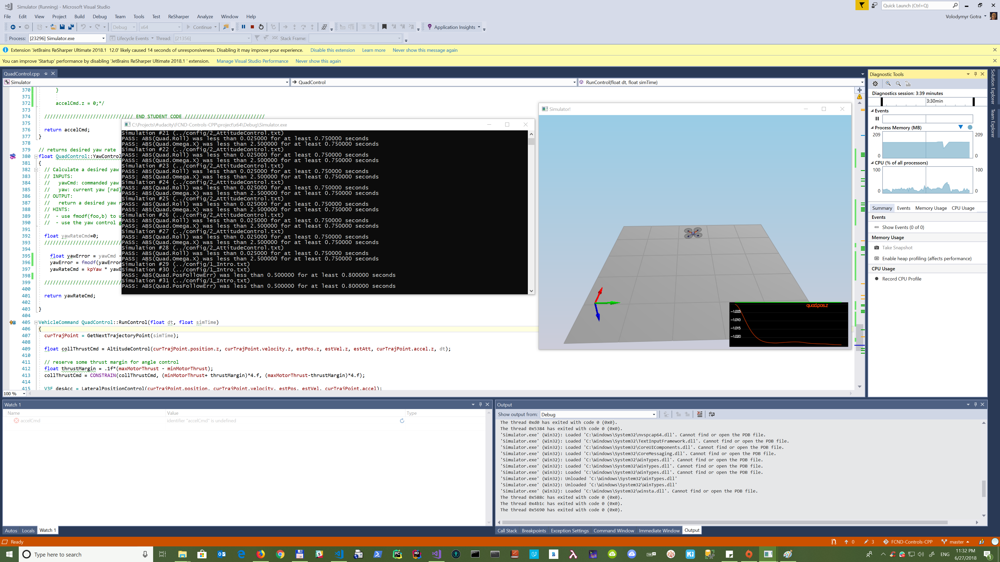
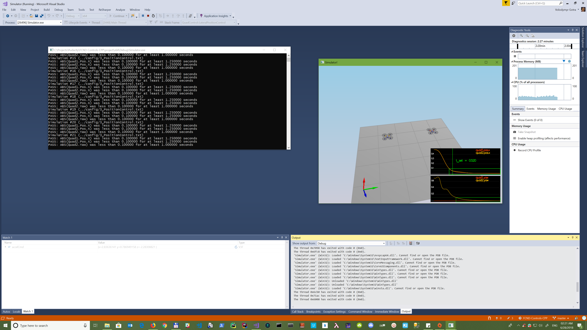
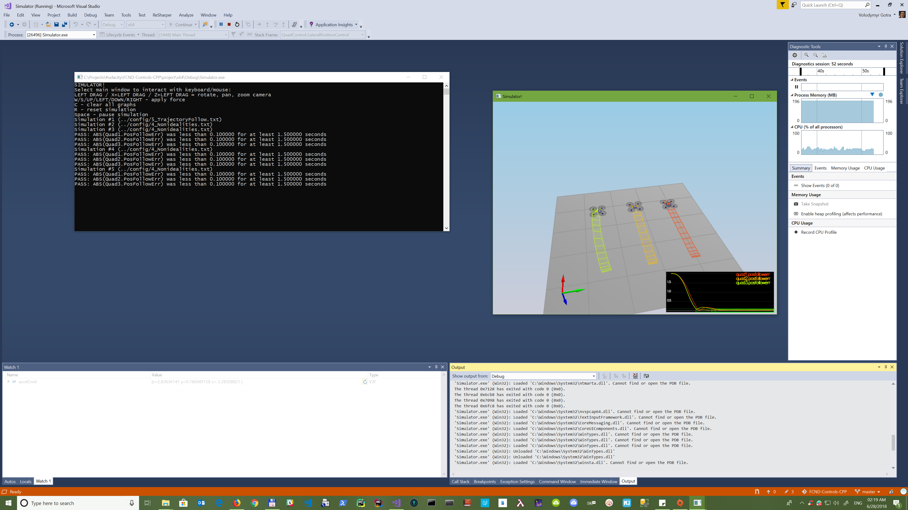
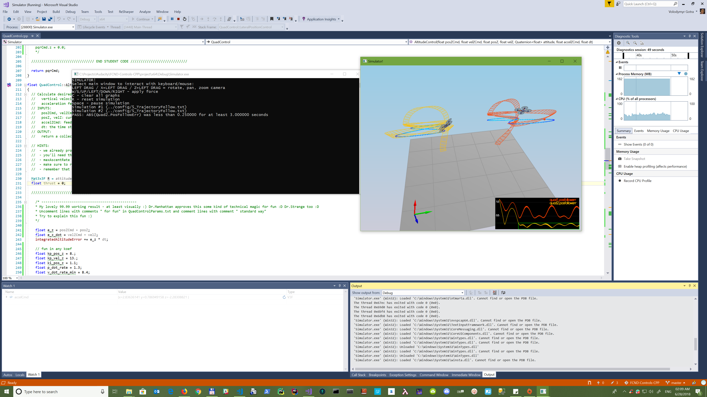
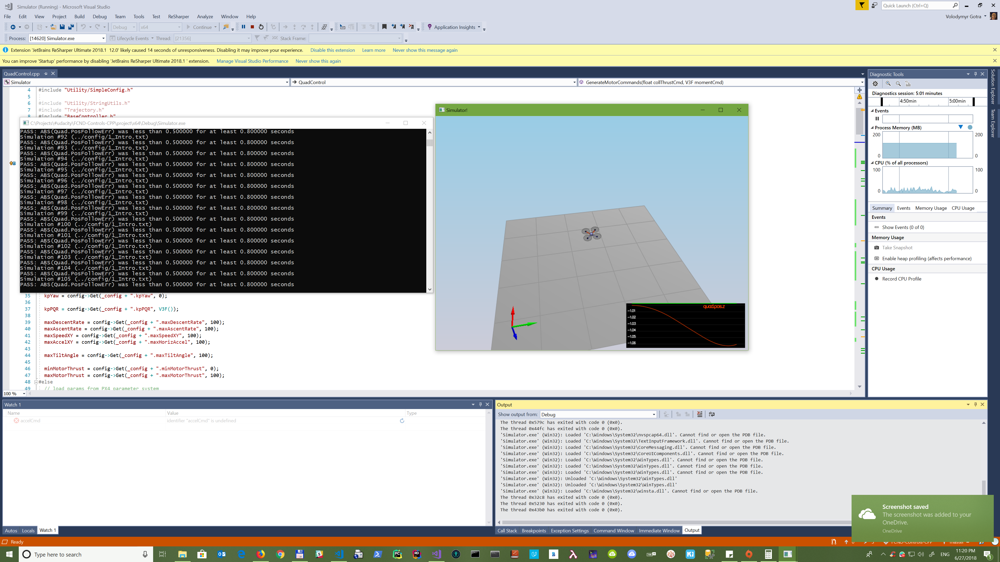
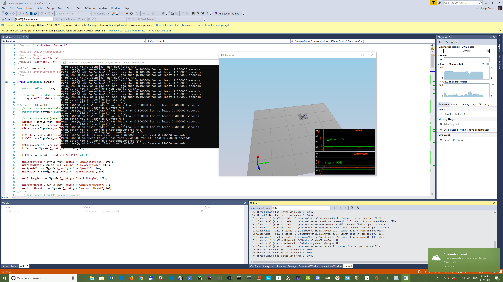
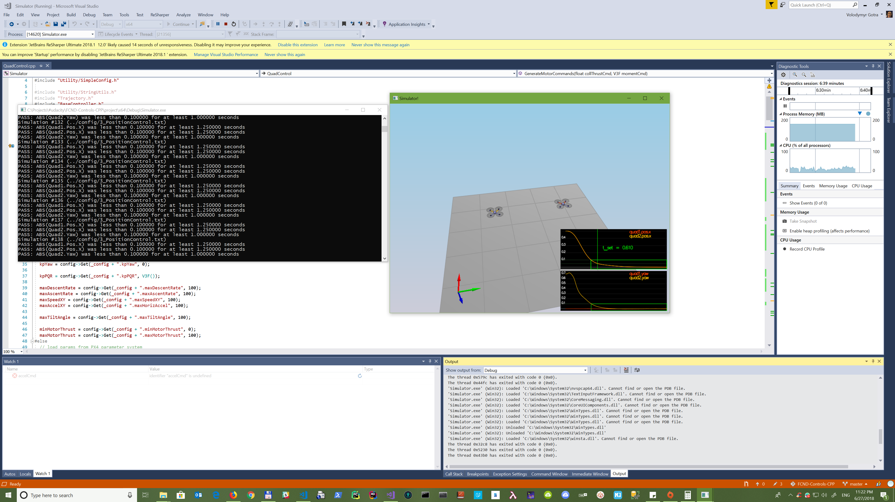
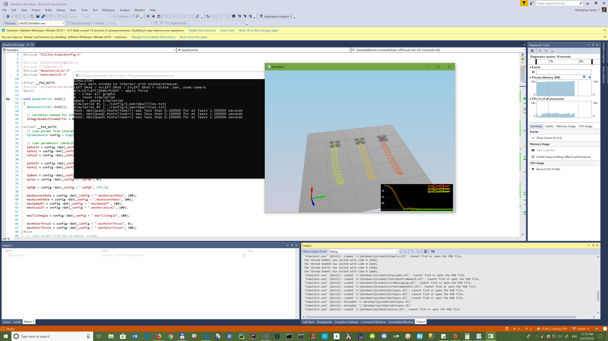
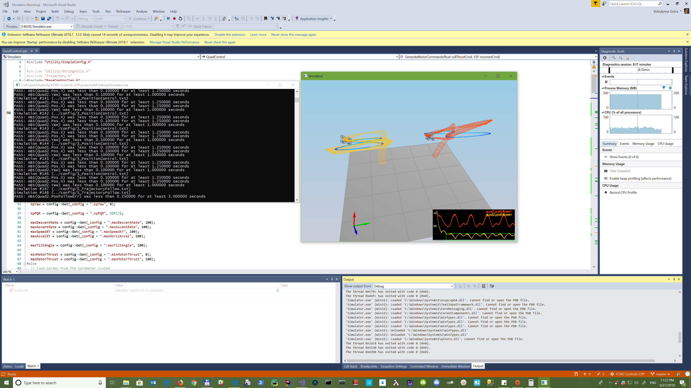

# The C++ Project Readme

## The different way to get a fun and check a posibilities

Just reused api and absolutely different approach and coeficients(some magic numbers).
It seems that simulator and api allow that. Results are very funny :) 
You can check fun in code... 
Try to explain such fun from math and physics points of view :)

### Scenario 1 alternative

Tuned and implemented alternative way. Works nice and according to metrics.

### Scenario 2 alternative

Tuned and implemented alternative way. Works nice and according to metrics.

### Scenario 3 alternative

Tuned and implemented alternative way. Works nice and according to metrics.

### Scenario 4 alternative

Tuned and implemented alternative way. Works nice and according to metrics.

### Scenario 5 alternative

Tuned and implemented alternative way. Works nice and according to metrics. 
Collective thrust is less than in standard way (maybe this can cause less energy consumption - but this is just theory)

## The tasks according to requirements

Reused api and some standard approach (with changes from community in Slack, etc.). 
Wasn't able to apply theoretical knowledge to write according to formulas (for many reasons - different simulator, different api, different names, different explanations, and many other reasons...). 
Was able to apply maybe 10-15% from a theoretical course - and that's a big problem. 
Created a cheat-sheet with folmulas (in folder **CheatSheet**) but it's not helpful...

### Scenario 1

Tuned and implemented. Works nice and according to metrics.

### Scenario 2 - Body rate and roll/pitch control

Tuned and implemented. Works nice and according to metrics.

### Scenario 3 - Position/velocity and yaw angle control

Tuned and implemented. Works nice and according to metrics.

### Scenario 4 - Non-idealities and robustness

Tuned and implemented. Works nice and according to metrics.

### Scenario 5 Tracking trajectories

Tuned and implemented. Works nice and according to metrics.

### Extra Challenge 1 (Optional) ###

Didn't implement

### Extra Challenge 2 (Optional) ###

Didn't implement